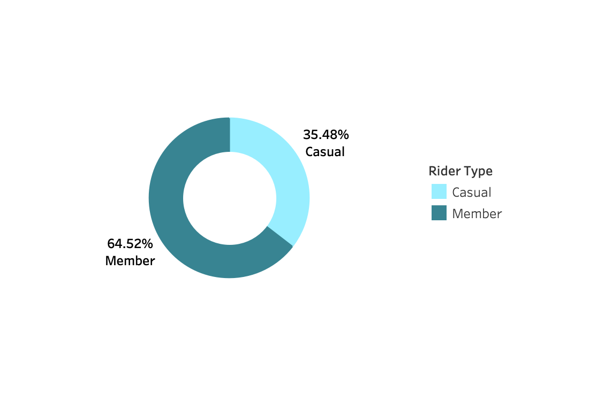
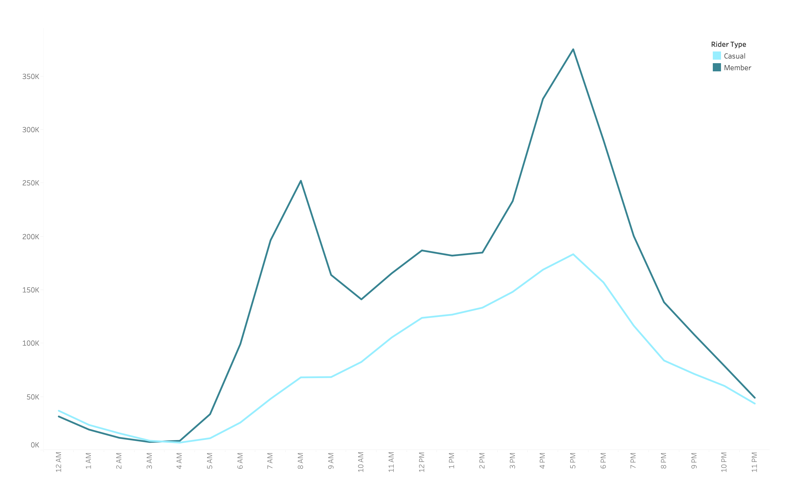
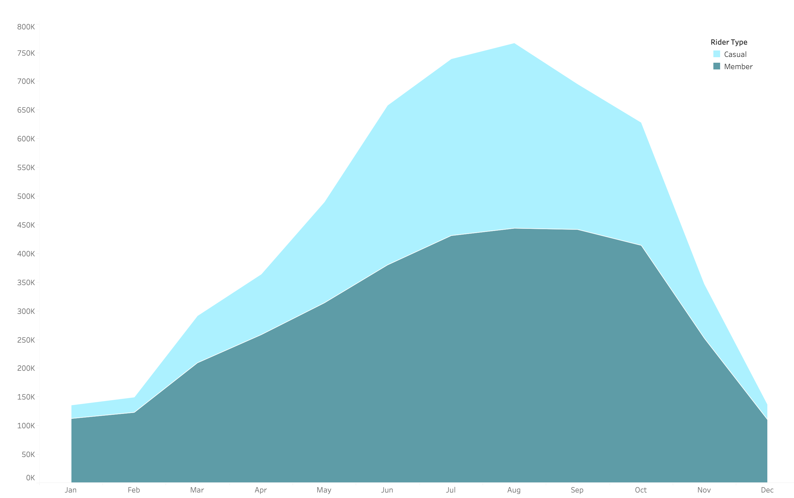
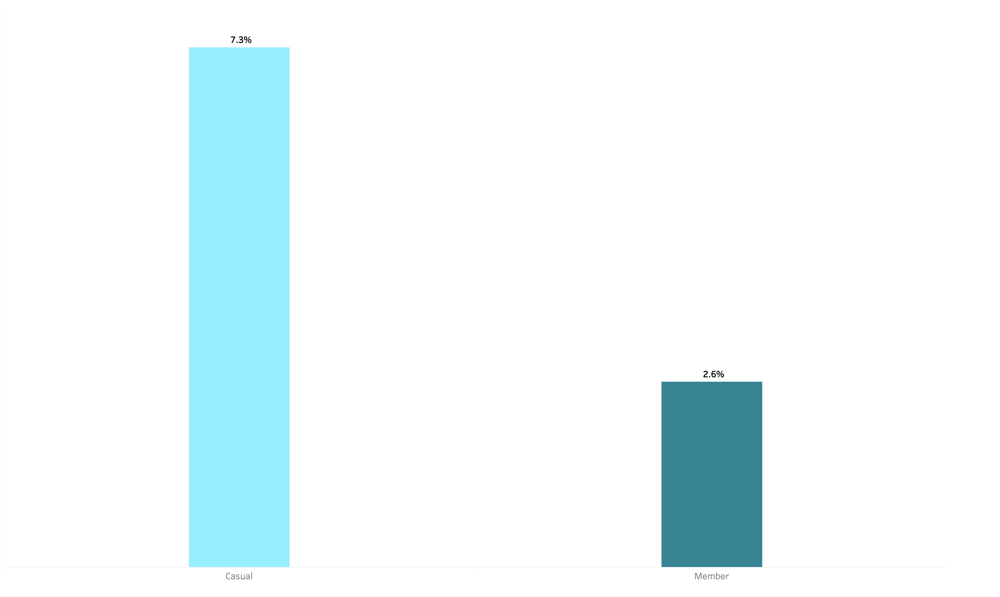

# Cyclistic Bike-Share Analysis
## Project Overview
This case study analyzes Cyclistic rider behavior using real-world data from Divvy, Chicago's bike-share program. Using SQL and Tableau, the analysis compares casual riders and annual members to uncover insights that can support membership conversion strategies. This project was completed as part of the Google Data Analytics Professional Certificate. 
- **Tableau Public Dashboard:** [View Interactive Dashboard](https://public.tableau.com/app/profile/nicole.beri/viz/Cyclistic_Bike_Share_Analysis_17792397883410/MainDashboard)

## Business Task
Analyze historical trip data to identify key behavioral differences between casual riders and annual members. The objective is to provide actionable, data-driven insights and strategic recommendations to convert casual riders into annual members, thereby maximizing future growth and recurring revenue.

## Data
- **Data Source:** [Divvy Trip Data](https://divvy-tripdata.s3.amazonaws.com/index.html)
- **Data Range:** 01/2025 - 12/2025
- The data has been made available by Motivate International Inc, under this [license](https://divvybikes.com/data-license-agreement)
  
## Tools & Skills Used
- **SQL:** Data Aggregation, Data Cleaning, Feature Engineering, Subqueries
- **Tableau:** Interactive Dashboard Design, Data Visualization, Calculated Fields, Geospatial Mapping, Dynamic Filtering

## Data Preparation
The 12 monthly CSV files were uploaded to Google BigQuery SQL and merged into a single master table using `UNION ALL` to create a complete trip dataset covering a full year of trip history for 2025.

View the data merging query here: [sql/01_data_merging.sql](sql/01_data_merging.sql).

## Data Validation 
Before cleaning the dataset, exploratory SQL queries were used to assess overall data quality and identify inconsistencies within the raw trip data. 

Validation checks included:
- Detecting null and missing values
- Checking for duplicate ride IDs
- Identifying ride duration outliers
- Detecting potential maintenance or test stations
- Evaluating incomplete coordinate records

View the exploratory analysis and quality check queries here: [sql/02_data_validation.sql](sql/02_data_validation.sql)

## Data Cleaning
A cleaned dataset table was created in BigQuery to prepare the dataset for visualization and analysis. 

Cleaning and transformation steps included:
- Removing rides with missing end coordinates
- Excluding rides with duration outliers (shorter than 1 minute and longer than 24 hours).
- Generating time-based analytical features:
    - Ride duration (minutes)
    - Day of week
    - Month
    - Hour
   
View the data cleaning and transformation queries here: [sql/03_data_cleaning.sql](sql/03_data_cleaning.sql)

## Data Analysis & Key Insights
### 1. Rider Composition
With a total of 5.40M rides, annual members accounted for 64.52% of total rides, while casual riders accounted 35.48% of total rides.
 

### 2. Commute vs. Leisure 
Members primarily use Cyclistic for commuting purposes, with traffic peaking at 8 AM and 5 PM on weekdays, specifically around corporate and transit-heavy hubs. Casual riders follow a more leisure-oriented behavior, with traffic peaking from 12 PM to 5 PM on weekends, specifically around waterfront and landmark stations.

### 3. Seasonal Trends
Casual ridership showed significantly stronger seasonality, peaking in the summer months and declining sharply in off-season months. Member ridership remained more stable throughout the year. 

### 4. Ride Duration & Round Trip Behavior
Casual riders have an average ride duration of 19.4 minutes, which is 65% longer than the average ride duration of 11.7 minutes for members.
Casual riders are 3x more likely to take round trips (7.3%) compared to members (2.6%).

## Recommendations
### 1. Weekend Explorer Membership: 
Introduce a lower-cost annual membership specifically for weekend usage. 
A weekend membership is a great offer for casual riders who aren't ready to commit to a full-price membership. 

### 2. Round Trip Rewards Program: 
Offer a promotion where casual riders receive reward points or credit towards an annual membership for each completed round trip. This program is a great opportunity to transition casual riders into annual members.

### 3. Early Bird Membership Discount: 
Launch a targeted campaign in March specifically for casual riders who were active last summer. 
Offering a spring discount secures loyalty and shifts casual riders into annual members. 
